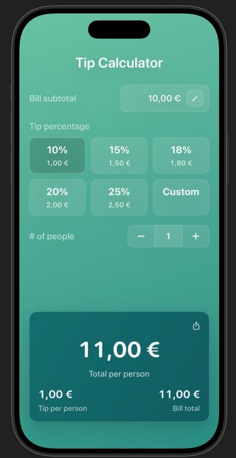

# TipCalculator

A modern, minimal SwiftUI Tip Calculator built with clean architecture principles and a polished glass-style interface.

The app provides an intuitive tipping experience with real-time calculations and a clean gradient-based design.

---

## Final UI



---

## Features

- Bill subtotal input with live currency formatting  
- Quick tip percentage selection (10%, 15%, 18%, 20%, 25%)  
- Custom tip percentage option  
- Adjustable number of people  
- Real-time calculation of:
  - Tip per person  
  - Total per person  
  - Bill total  
- Modern gradient background  
- Glass-style card components  
- Share button placeholder (ready for integration)

---

## Architecture

The app follows SwiftUI’s **single source of truth** principle.

### State Management

- `@State` for local state ownership  
- `@Binding` for passing state between views  
- Modular reusable view components  

Example:

```swift
@State private var people: Int = 1
